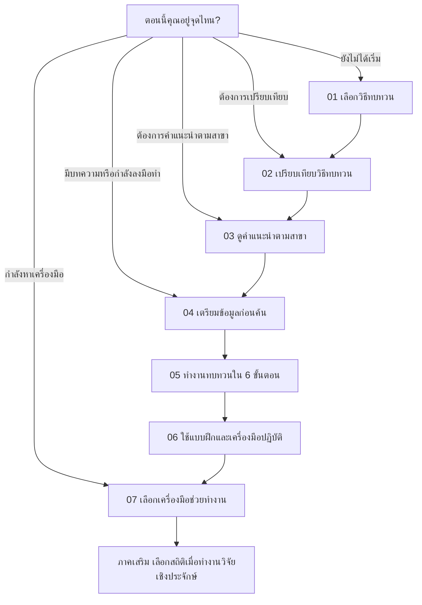

# Design

## Source of truth

- Status: Active
- Last refreshed: 2026-07-22
- Primary product surfaces: the single LitWise research-guide page in English and Thai
- Evidence reviewed: `../lit-review-guide/index.html`, `../lit-review-guide/styles.css`, `../lit-review-guide/app.js`, `../lit-review-guide/data.js`, `app/page.tsx`, `app/guide-client.tsx`, `app/research-workbench.tsx`, `app/globals.css`, `app/i18n.ts`, `app/guide-data.ts`, `app/research-tools.ts`, and `tests/`

## Brand

- Personality: editorial, academically credible, direct, calm, and practical
- Trust signals: transparent method trade-offs, official sources, explicit workflow outputs, plain-language warnings, and consistent bilingual terminology
- Avoid: ornate botanical styling, oversized art-book typography, generic SaaS dashboards, neon AI aesthetics, hidden navigation, and decorative complexity that competes with the research decisions

## Product goals

- Goals: help master's and PhD students identify a defensible review method, see what to do next, and find field-specific tools and standards
- Non-goals: replace supervision, promise methodological certainty, automate screening decisions, or reproduce the reference project's data model
- Success signals: users can choose an entry point, complete the method pathway, compare methods, find their discipline, and reach an appropriate tool without reading the whole page

## Personas and jobs

- Primary personas: master's students, PhD candidates, early-career researchers, supervisors, and research-team members
- User jobs: turn a topic into a review design, choose a method, plan the workflow, locate databases and standards, select working tools, and avoid common mistakes
- Key contexts of use: laptop research sessions, mobile orientation, supervision meetings, and printed/PDF planning notes

## Information architecture

- Primary navigation: Start, Methods, Disciplines, Prepare, Workflow, Practice, Tools
- Core routes/screens: one long-form page with anchored sections and modal-like method/discipline deep dives
- Content hierarchy: hero -> situation-based entry points and journey overview -> `01` decision wizard -> `02` method library and comparison -> `03` discipline library -> `04` pre-search framing -> `05` expandable six-phase workflow -> `06` project workbench -> `07` search/appraisal/tools/templates and pitfalls -> unnumbered statistics supplement -> closing action

### User journey and numbering

The situation cards are shortcuts, not numbered chapters. Users may jump to the section that matches their current state, while the chapter numbers remain a stable reading order.

Numbering rules:

- Use `01`-`07` only for the main literature-review journey.
- Use `A`-`D` on entry-point cards so situational shortcuts cannot be mistaken for the `01`-`07` chapter sequence.
- Label statistics as `Supplement` / `ภาคเสริม`; it supports research methodology but is not a literature-review stage.
- Do not reuse a chapter number for a tool, subsection, or alternate route.

## Design principles

- Match the approved `lit-review-guide` interaction grammar before inventing new patterns.
- Show a clear next action at every stage; deep detail appears after selection, not before orientation.
- Keep the page scannable through centered section headings, compact cards, tags, and alternating surfaces.
- Tradeoff: LitWise carries more detailed content than the reference, so modal panels may scroll and tool sections may be longer while preserving the same hierarchy and component language.

## Visual language

- Color: `#fafaf7` background, `#ffffff` elevated cards, `#f3f1ec` alternate bands, `#0f172a` navy, `#c2855b` amber, semantic indigo/emerald/rose tags, and equivalent dark-mode surfaces
- Typography: Fraunces for English display text; Inter for English UI/body; Noto Sans Thai for all Thai text; JetBrains Mono for labels, numbers, tags, and code
- Spacing/layout rhythm: 1200px container, 24px page gutters, 96px desktop sections, 64px mobile sections, 16-24px card gaps
- Shape/radius/elevation: 8/14/20px radii, light 1px borders, subtle layered shadows, pill controls
- Motion: short 150-300ms hover and state transitions; all nonessential movement disabled under reduced motion
- Imagery/iconography: CSS-based research artefacts and minimal typographic icons; no decorative generated illustrations are required

## Components

- Existing components to reuse: decision pathway state, method ranking, bilingual datasets, workflow phases, toolkit, templates, and copy actions
- New/changed components: sticky reference-style nav, theme toggle, PRISMA/checklist hero stack, top-progress wizard, method card grid and comparison table, discipline card grid, accessible modal-like details, expandable workflow cards, a browser-local project checklist, question-framework builder, screening calibration lab, simplified PRISMA planner, reference-style tool cards, and a bilingual Prompt Lab with explicit evidence guardrails
- Variants and states: default/hover/active/selected/disabled for cards and pills; light/dark surfaces; empty search state; copied state; open/closed detail dialogs
- Token/component ownership: `app/globals.css` owns tokens and visual variants; `app/page.tsx` owns static metadata; `app/layout.tsx` seeds browser preferences; `app/guide-client.tsx` owns locale, theme, interactive state, and semantic page markup

## Accessibility

- Target standard: WCAG 2.1 AA for core reading and interaction
- Keyboard/focus behavior: visible focus rings, buttons for interactive cards, Escape and explicit close controls for dialogs, and no keyboard traps
- Contrast/readability: body text at 16px; Thai body text at 16px with 1.75 line-height; muted colors retain readable contrast
- Screen-reader semantics: labelled navigation, progress, search, filter groups, dialogs, tables, and status updates
- Reduced motion and sensory considerations: respect `prefers-reduced-motion`; meaning never depends on color or animation alone

## Responsive behavior

- Supported breakpoints/devices: desktop >= 981px, tablet 641-980px, mobile <= 640px, compact mobile <= 480px
- Layout adaptations: hero changes from two columns to a stacked flow; navigation links collapse; grids reduce to one column; wizard gutters and modal padding shrink; stats wrap
- Touch/hover differences: touch targets remain at least 40px and all hover-only affordances also have persistent labels

## Interaction states

- Loading: not applicable; all guide content is local
- Empty: discipline search displays a localized empty message and no contradictory detail
- Error: clipboard failure does not destroy content; the original text stays selectable
- Success: selections, active filters, copied labels, pathway completion, checklist progress, screening score, and PRISMA totals receive explicit text/state feedback
- Disabled: incomplete wizard steps and unavailable next actions are visibly muted and disabled
- Offline/slow network: core page and local data work after the app loads; external official links may be unavailable

## Content voice

- Tone: direct, supportive, academically honest, and natural in each language
- Terminology: use established review-method names; show English method terms where a Thai translation could become ambiguous
- Microcopy rules: name the user's next action, avoid translated idioms, avoid fake confidence scores, and distinguish guidance from final methodological approval

## Implementation constraints

- Framework/styling system: standard Next.js 16 + React 19 + global CSS, packaged as a provider-neutral standalone Node.js application with a conditional static export for GitHub Pages
- Design-token constraints: extend the root variables in `app/globals.css`; do not add a second styling framework
- Performance constraints: no heavy animation or image dependency; all filters and content remain client-local
- Privacy constraints: checklist state may use browser `localStorage`; workbench inputs and calculations stay client-side and require no account or research-data upload
- Compatibility constraints: standard Next.js standalone build, Node.js 22+, portable container deployment, and GitHub Pages static export without request-time middleware
- Test/screenshot expectations: build, lint, unit/render tests; reference and generated screenshots at the available in-app desktop viewport, plus explicit inspection of the 600px responsive rules; Visual Ralph verdict target >= 90 for hierarchy/component-language match. Record exact capture dimensions rather than claiming an emulated viewport that was not used.

## Open questions

- [ ] None blocking. Revisit whether method and discipline details should become dedicated routes only if future analytics show modal depth is insufficient.
